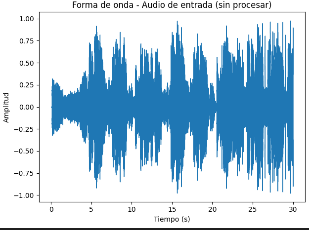

# Sistema de Recomendación Musical basado en MFCC e Indexación Invertida

## Descripción General

Este proyecto implementa un sistema de recomendación musical basado en el contenido acústico de los audios, utilizando **coeficientes MFCC (Mel-Frequency Cepstral Coefficients)** y un enfoque de **indexación invertida para descriptores locales**.  
Permite realizar búsquedas y generar recomendaciones musicales basadas en similitud de timbre y características espectrales de las canciones.

Se procesaron **2913 audios** en formato `.wav`, considerando los primeros 30 segundos de cada pista para extraer sus características.

---

## Funcionalidades

- Extracción automática de características acústicas (**MFCC**) desde archivos `.mp3`, `.mpeg` o `.wav`.
- Clustering acústico mediante **K-Means** para la construcción de un "diccionario acústico" (*Bag of Acoustic Words*).
- Representación de cada audio como un histograma de "Acoustic Words".
- Recomendación de canciones mediante métricas de similitud:  
  - Distancia coseno  
  - Distancia Manhattan  
  - Distancia Euclidiana
- Inserción automática de nuevos audios con su procesamiento completo.
- Unión con metadatos musicales desde archivos CSV extendidos.

---

## Estructura del Proyecto

```
.
├── dataset/
│   └── spotify_songs_download.csv
├── utils/
│   ├── scaler.joblib
│   ├── Kmeans.joblib
│   └── histogramas_acusticos.json
├── audios_temp/          # Audios en procesamiento temporal
├── audios_wav/           # Audios convertidos a WAV
├── process/
│   └── extract_audio_functions.py
├── proyect_audio.ipynb   # Notebook de análisis
└── requirements.txt
```

---

## Proceso de Funcionamiento

### 1. Extracción de MFCC
Se extraen los coeficientes MFCC de cada audio usando la librería `librosa`, representando el timbre y la forma espectral de cada señal.

*Ejemplo de visualización:*
- **Forma de onda de un audio sin procesar**  
  
- **Evolución del primer coeficiente MFCC**  
  

### 2. Bag of Acoustic Words
Los vectores MFCC de todos los audios se agrupan mediante **K-Means**, generando un diccionario de "palabras acústicas".

### 3. Normalización y Clustering
Se normalizan las características con `StandardScaler` y se aplica K-Means.  
El número óptimo de clusters se define con el método del codo.

*Ejemplo de selección de clusters:*  


### 4. Generación de Histogramas Acústicos
Cada canción se representa como un histograma de frecuencias de "palabras acústicas", lo que facilita la comparación y búsqueda por similitud.

---

## Instalación de Dependencias

### Requisitos previos
- Python 3.13 o versión compatible
- `ffmpeg` instalado en el sistema
- `pnpm` instalado globalmente (para la parte frontend, si aplica)

### Instalación del entorno
```
pip install -r requirements.txt
```

**Dependencias principales:**
- librosa
- numpy
- pandas
- scikit-learn
- joblib

---

## Uso

### Verificación de recursos
Asegúrese de contar con los siguientes archivos:
- `./dataset/spotify_songs_download.csv`
- `./utils/scaler.joblib`
- `./utils/Kmeans.joblib`
- `./utils/histogramas_acusticos.json`
- `./process/extract_audio_functions.py`

### Recomendaciones por archivo de audio
```python
audio = "C:/ruta/archivo.mpeg"
recomendaciones = obtener_recomendaciones_por_audio_mp3(audio, k=5, tipo="coseno")
```

### Recomendaciones por ID de canción
```python
recomendaciones = obtener_recomendaciones_por_song_id(2913, tipo="manhattan", k=5)
```

### Insertar un nuevo audio
```python
id = max_key("./utils/histogramas_acusticos.json") + 1
insert_audio("C:/ruta/archivo.mpeg", id)
```

**Este proceso:**
1. Convierte el archivo a formato WAV.
2. Extrae los coeficientes MFCC.
3. Genera el histograma acústico.
4. Inserta la información en el JSON y actualiza el CSV base.

### Unión con metadatos extendidos
```python
df = pd.read_csv("./dataset/spotify_songs_download.csv")
df['id'] = df['id'].astype(str)
filas = df[df['id'].isin(recomendaciones)]
filas['score'] = filas['id'].map(recomendaciones)

df_genre = pd.read_csv('./dataset/spotify_songs_download_FINAL.csv')
df_genre['id'] = df_genre['id'].astype(str)
join_data = pd.merge(filas, df_genre, on='id', how='left')
```

---

## Consideraciones
- Utilizar audios de buena calidad (mínimo 30 segundos).
- La métrica de similitud puede cambiarse dinámicamente.
- El sistema está preparado para insertar nuevos audios sin afectar el histórico.

---

## Créditos
Este proyecto fue desarrollado como parte del curso **Base de Datos 2 (BD2)**, integrando procesamiento de audio, clustering y recomendaciones musicales mediante similitud acústica.  
Trabajo realizado de manera colaborativa por el equipo de estudiantes.
